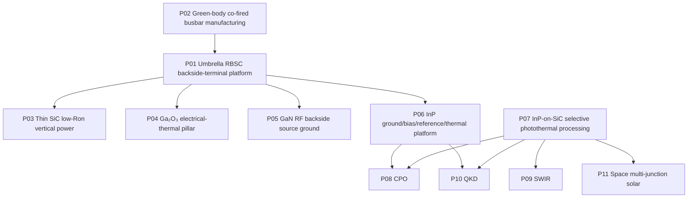

# Patent Portfolio — Cools RBSC Backside Busbar Platform

## 11 patent-filed invention axes

This document organizes the Cools RBSC Backside Busbar Platform into one umbrella infrastructure, one manufacturing family and nine device/application families.

The portfolio deliberately excludes the separate invention concerning a non-equilibrium-frozen GaN gate interface for robot-joint motor drives. That invention belongs to the chamber-free sub-bandgap interface-processing family, not to this RBSC backside-busbar portfolio.

---

## Common technical engine

```text
Thin active semiconductor
+ backside ohmic / ground / common-bias landing
+ RBSC support
+ large-area conductive through-busbar
+ backside power terminal or ground plane
= controlled electrical path + low-inductance reference + vertical heat extraction
```

The common platform logic is:

1. retain expensive single-crystal or III–V material only in the active region;
2. use RBSC as the mechanical, thermal and package-support volume;
3. do not depend on the variable electrical resistance of the RBSC bulk;
4. route current, ground return or common bias through a designed metal through-busbar;
5. use the same busbar as a vertical thermal pillar where the application benefits from concentrated backside cooling; and
6. optionally activate buried ohmic or joining interfaces by localized photothermal processing without globally heating the RBSC structure.

---

# Portfolio map

| ID | Invention axis | Primary role |
|---|---|---|
| P01 | RBSC thin-film semiconductor backside-terminal umbrella platform | material-neutral lower infrastructure |
| P02 | Green-body co-fired large-area conductive through-portion | scalable support manufacturing |
| P03 | Thin SiC vertical power device without thick conductive substrate | substrate-resistance removal |
| P04 | Ga₂O₃ vertical power device with electrical–thermal through-pillar | self-heating bottleneck removal |
| P05 | GaN RF HEMT with TSV-free backside source ground | low-inductance RF grounding |
| P06 | InP optoelectronic device with backside common ground/bias and cooling | high-speed reference and heat integration |
| P07 | Selective photothermal processing of InP-on-SiC thin-film stacks | local optical-property and interface tuning |
| P08 | SiC-supported InP CPO optical engine | dense optical-engine thermal stabilization |
| P09 | SiC-mediated bump-free InGaAs SWIR image sensor | fine-pitch low-noise imaging |
| P10 | SiC-supported InP quantum-key-distribution photonics | single-photon thermal and phase stability |
| P11 | SiC-supported InP multi-junction space solar cell | lightweight thermal support and junction freedom |

---

# P01 — Umbrella backside-terminal platform

## Patent axis

**Reaction-Bonded Silicon Carbide Support-Based Thin-Film Semiconductor Backside Terminal Platform Incorporating Large-Area Conductive Through-Portions, and Manufacturing Method Thereof**

## Problem addressed

RBSC is attractive as a low-cost, stiff and thermally conductive support, but its bulk electrical resistivity can vary substantially with residual silicon content, composition and process history. A platform that relies on RBSC bulk conductivity would therefore inherit lot-to-lot terminal resistance variation.

## Core structure

- thin semiconductor layer or semiconductor stack;
- lower ohmic contact or lower connection metal;
- RBSC support;
- one or more large-area conductive through-portions;
- optional upper current-spreading metal;
- backside electrode.

The primary current does not use the RBSC bulk as its dominant conductive path. It is routed through the metal through-portion.

## Key differentiators

- material-neutral application to SiC, Ga₂O₃, GaN and InP-based devices;
- minimum transverse dimension of 0.3 mm or greater, distinguishing the structure from a fine signal via;
- preferred 0.5–5 mm busbar-class dimensions;
- representative conductive opening ratio of 5–60%;
- dominant current fraction described as 50%, preferably 80%, and more preferably 95% or greater;
- active-region placement and exclusion under electric-field termination regions;
- integrated electrical terminal, thermal path, mechanical support and package-base functions.

## Strategic position

P01 is the umbrella claim family. P02 protects how the support is manufactured. P03–P11 protect material- and market-specific use of the same lower infrastructure.

---

# P02 — Green-body co-fired RBSC busbar support

## Patent axis

**Method of Manufacturing a Backside-Terminal Support by Integrally Forming a Large-Area Conductive Through-Portion in an RBSC Support via Green-Body Co-Firing, and the Support Thereof**

## Problem addressed

Post-sinter drilling of dense SiC is slow, tool-intensive and restrictive for large or high-aspect-ratio openings. Co-firing a conductor with an RBSC green body is difficult because molten silicon can wet, alloy or silicide the conductor and because thermal-expansion and shrinkage mismatch can open leakage gaps.

## Core manufacturing routes

1. sacrificial pin or rod followed by cavity filling;
2. refractory metal core co-firing;
3. co-fired refractory liner followed by low-resistance metal filling.

## Core interface controls

- SiC-rich sleeve;
- barrier coating;
- hermetic encapsulation;
- protected low-resistance conductor core;
- controlled transition skin at the conductor/RBSC boundary;
- matched conductor CTE and green-body shrinkage;
- gap-free, hermetic co-fired interface.

## Structural fingerprint

The completed support can exhibit a metallurgically continuous co-fired transition interface without a machined bore wall and without the separate bonding layer characteristic of post-drilled and filled structures.

## Commercial position

P02 covers the scalable near-net-shape manufacturing route and intermediate green-body assembly, not merely the final semiconductor device.

---

# P03 — Thin SiC vertical power device without thick conductive substrate

## Patent axis

**Low On-Resistance Vertical Silicon Carbide Power Semiconductor Device Having a Thin SiC Active Layer Without a Thick Conductive Substrate and Employing a Large-Area RBSC Through-Portion as a Backside Drain**

## Problem addressed

A conventional vertical SiC device includes a thick conductive SiC substrate in series with the drift region. The substrate adds resistance but contributes little to voltage blocking. Wafer thinning cannot completely eliminate that resistance and creates mechanical handling loss.

## Core structure

- thin SiC active layer containing the drift region and thin highly doped backside contact region;
- no thick conductive SiC substrate in the final drain-current path;
- backside ohmic contact;
- RBSC support;
- large-area conductive through-busbar;
- backside drain or cathode electrode.

## Important boundary

The invention does **not** remove the voltage-supporting drift layer. It removes the thick substrate below the drift layer that mainly serves mechanical and backside-current functions.

## Functional result

```text
Ron,sp conventional
= channel + JFET + drift + thick-substrate + contact resistance

Ron,sp Cools
= channel + JFET + drift + through-busbar + contact resistance
```

The same busbar also provides a vertical heat path. The RBSC support replaces the handling function of a thick, fragile SiC wafer.

## Target devices

- planar and trench MOSFETs;
- SBD and JBS diodes;
- PIN and related vertical devices;
- patent-described voltage range from 650 V to 10 kV, with particular relevance to 650–1700 V where substrate resistance can be more significant.

---

# P04 — Ga₂O₃ electrical terminal and vertical thermal pillar

## Patent axis

**Gallium Oxide-Based Vertical Power Semiconductor Device Employing a Large-Area Conductive Through-Portion as a Combined Backside Electrical Terminal and Vertical Heat-Extraction Path**

## Problem addressed

Ga₂O₃ has a high breakdown field but very low thermal conductivity. Adding an external heat spreader after device fabrication leaves low-conductivity lateral paths and multiple bonding interfaces in series.

## Core structure

- thin Ga₂O₃ active layer;
- lower ohmic contact;
- optional SiC thermal-matching/spreading intermediate layer;
- RBSC support;
- large-area conductive through-portion aligned below the hotspot;
- backside drain/cathode and cooling surface.

## Core design rule

The vertical thermal resistance through the metal through-portion is lower than the alternative lateral Ga₂O₃ and RBSC-bulk path.

Patent embodiments describe:

- at least 50%, preferably 70%, and more preferably 90% or more of generated heat extracted through the through-portion;
- 5–60% conductive opening ratio;
- busbar, slot or inserted-metal-bar geometry;
- electrical-terminal and thermal-pillar functions in the same element.

## Strategic value

P04 directly addresses the central materials contradiction of Ga₂O₃: high electric-field capability that cannot be translated into high power density because of self-heating.

---

# P05 — GaN RF HEMT with TSV-free backside source grounding

## Patent axis

**Lateral GaN RF HEMT Employing a Large-Area Conductive Through-Portion of an RBSC Support as a Backside Ground Terminal and Low-Inductance Source-Ground Path**

## Problem addressed

A lateral GaN RF HEMT requires a low-inductance source ground. Conventional processing thins the substrate and etches deep, fine through-substrate vias from the backside. This limits cross-section, placement freedom, throughput and mechanical yield.

## Core structure

- front-side source, gate and drain remain lateral;
- front-side source connects by a short, low-aspect-ratio opening, landing, strap or air bridge to a pre-formed large-area busbar;
- busbar connects to the backside ground plane;
- busbar also acts as a vertical heat path.

## Key differentiators

- no requirement for backside high-aspect-ratio TSV etching through the completed device substrate;
- source-finger-aligned busbar geometry;
- backside RF reference plane;
- simultaneous reduction of source inductance and hotspot temperature;
- application to individual HEMTs, multi-finger devices and MMICs.

Patent embodiments describe routing 50%, preferably 80%, and more preferably 95% or more of source-ground return current through the busbar.

---

# P06 — InP backside common ground, bias, high-speed reference and heat

## Patent axis

**InP-Based III–V Optoelectronic Device and Optical Engine Employing an RBSC Large-Area Conductive Through-Portion as a Backside Common Ground/Bias Terminal, Low-Inductance High-Speed Reference Plane and Vertical Heat-Extraction Path**

## Problem addressed

InP optoelectronic devices require both low-inductance grounding and strong thermal management. Conventional designs separate these requirements into wire-bond ground paths and soldered submount/heat-sink paths.

## Core structure

- front-side optical and signal electrodes remain accessible;
- common ground or bias is routed to a large-area busbar through a short front-side landing structure;
- the busbar connects to a continuous backside ground/thermal plane;
- the same busbar extracts heat from the active region.

## Target devices

- DFB and DBR lasers;
- electro-absorption modulated lasers;
- Mach–Zehnder modulators;
- semiconductor optical amplifiers;
- photodiodes, APDs and SPADs;
- CPO and LiDAR transmit/receive engines.

## Functional distinction by device

- lasers/EMLs: common cathode or anode plus heat extraction;
- PD/APD/SPAD: bias return and low-noise ground;
- MZM: RF ground/reference and bias return;
- SOA: bias return and heat extraction.

---

# P07 — Selective photothermal processing of InP-on-SiC thin films

## Patent axis

**Method for Locally Photothermally Treating a Selective Absorption Region in an InP-Based III–V Optically Functional Thin-Film Stack Comprising a SiC-Based Supporting Layer**

## Problem addressed

Blanket furnace or rapid thermal annealing raises the thermal budget of the entire transferred III–V stack and can damage the underlying CMOS, ASIC or bonding interface. Device-by-device wavelength correction is difficult with global heating.

## Core method

A photothermal beam enters through the front, backside, side, optical via or transparent window and is absorbed only in a selected region of the InP-based thin-film stack.

Selectable absorbers include:

- multiple quantum wells;
- doped regions;
- free-carrier absorption regions;
- implantation-damaged regions;
- defect states;
- metal underlayers;
- reaction layers;
- auxiliary optical absorbers.

## Functions

- quantum-well intermixing;
- local bandgap and emission/absorption wavelength shift;
- transfer-damage and point-defect recovery;
- dopant activation;
- channel-by-channel wavelength trimming.

## Control architecture

- wavelength, intensity, pulse duration and position modulation;
- scanning, mask or focused optics;
- photoluminescence, reflection and temperature monitoring;
- closed-loop endpoint control.

## Portfolio role

P07 is an optional process engine that supports P06 and P08–P11. It is not a mandatory element of every backside-busbar embodiment.

---

# P08 — SiC-supported InP Co-Packaged Optics

## Patent axis

**Co-Packaged Optics Optical Semiconductor Device Comprising an InP-Based III–V Optically Functional Thin-Film Layer Transferred and Bonded onto a SiC-Based Heat-Dissipating and Supporting Platform**

## Problem addressed

CPO places optical engines close to high-power switch or accelerator ASICs. InP has limited thermal conductivity, and wavelength-division-multiplexed channels are sensitive to temperature gradients and cross-heating.

## Core architecture

- SiC-based support, interposer or package base;
- transferred InP-based active optical thin films;
- laser, SOA, modulator and/or photodetector;
- optional Si, SiN, SiO₂ or SiC passive waveguide layer;
- ASIC placed adjacent to the optical engine;
- optional thermal-isolation structures between ASIC and optical engine;
- common external heat rejection through the SiC platform.

## Primary benefits claimed

- optical-engine junction-temperature reduction;
- wavelength and resonance stability;
- lower channel-to-channel thermal crosstalk;
- mechanical and optical-alignment stability;
- shorter SerDes electrical distance;
- lower use of bulk InP through thin-film transfer and donor reuse.

---

# P09 — Bump-free InGaAs SWIR image sensor

## Patent axis

**Short-Wavelength Infrared Image Sensor Comprising an InGaAs-Based Photodetecting Stack Transferred and Bonded onto a Silicon CMOS ROIC via a SiC-Based Thin Film**

## Problem addressed

Conventional InGaAs SWIR focal-plane arrays use pixel-by-pixel indium-bump flip-chip assembly to a silicon ROIC. Bump pitch and alignment constrain pixel scaling, large-area uniformity and cost. InP-based detector stacks also suffer thermal dark-current growth.

## Core architecture

- silicon CMOS ROIC;
- thin SiC intermediary;
- transferred thin InP/InGaAs detector stack;
- pixel-level connection through or around the SiC thin film;
- no pixel-by-pixel indium-bump requirement;
- optional extended-cutoff or multi-band detector stack.

## Patent-described design targets

- SWIR detection in the 0.9–1.7 µm range, with extended-cutoff variants;
- pixel pitches of 5 µm or below;
- reduced dark current and thermal noise through SiC heat spreading;
- fine-pitch, large-area and high-uniformity arrays;
- reduced bulk InP use through donor reuse.

## Relationship to the busbar platform

P09 uses a thin SiC intermediary and pixel-level connections rather than the millimeter-class power busbar as its only connection mechanism. It remains in the portfolio because it belongs to the same transferred III–V-on-SiC support and thermal-infrastructure family and can be combined with an RBSC backside cooling support beneath the ROIC/package.

---

# P10 — SiC-supported QKD photonics

## Patent axis

**Quantum Key Distribution Optical Semiconductor Device Comprising an InP-Based III–V Optically Functional Thin-Film Layer Transferred and Bonded onto a SiC-Based Heat-Dissipating and Supporting Platform**

## Problem addressed

QKD source purity, laser wavelength, detector dark counts, afterpulsing, interferometer phase and polarization encoding are temperature sensitive. Separate optical components and thermoelectric cooling increase volume, power and drift.

## Core architecture

- SiC-based heat-dissipating support;
- transferred InP-based source and/or InGaAs/InP SPAD thin-film structure;
- optional encoder, waveguide and graphene layer;
- integrated Alice transmitter or Bob receiver configuration;
- optical and electrical isolation between source and detector regions;
- optional backside common bias/ground and heat path from P06.

## Performance directions

- stable weak-coherent-pulse mean photon number and wavelength;
- improved quantum-dot or defect-source g²(0), linewidth and spectral stability;
- lower SPAD dark-count rate and afterpulsing;
- reduced TEC burden;
- lower phase/polarization drift and QBER.

---

# P11 — SiC-supported space multi-junction solar cells

## Patent axis

**Space Multi-Junction Solar Cell Comprising an InP-Based III–V Multi-Junction Optically Functional Thin-Film Layer Transferred and Bonded onto a SiC-Based Heat-Dissipating and Supporting Platform**

## Problem addressed

Conventional III–V space multi-junction solar cells are commonly grown on thick Ge substrates. The support is heavy, thermally limited and imposes lattice-matching constraints on sub-cell design. Ge, InP and ITO also add supply-chain exposure.

## Core architecture

- SiC-based lightweight heat-dissipating support;
- transferred InP-based III–V multi-junction thin-film stack;
- multiple sub-cells with different bandgaps;
- tunnel junctions or sequential transfer/bonding;
- optional graphene or other ITO-free transparent electrode;
- reusable donor substrates;
- array-level module integration.

## Strategic effects

- replacement of the Ge support function;
- greater freedom in sub-cell bandgap selection;
- higher junction-count architectures through transfer and bonding;
- higher specific power through reduced support mass;
- improved thermal spreading under concentration or high-temperature operation;
- reduced strategic-material use through thin-film transfer and donor reuse.

Patent-described junction counts and material-use reduction factors are engineering projections and must be validated experimentally.

---

# Cross-portfolio claim architecture



---

# Shared measurable fingerprints

## Busbar geometry

- transverse dimension at or above the patent-defined millimeter-class threshold;
- strip, slot, grid, busbar or inserted-bar layout;
- active-region or source-finger alignment;
- absence or spacing under high-field termination regions.

## Electrical routing

- low-resistance metal path dominant over RBSC bulk conduction;
- continuous backside power or ground plane;
- source-ground return or common-bias distribution aligned with the device layout;
- reduced extracted inductance relative to wire-bond or fine-TSV routes.

## Thermal routing

- hotspot-aligned vertical metal path;
- concentrated heat flux into the backside plane;
- lower junction-to-backside thermal resistance;
- shared electrical and thermal path through the same element.

## Co-fired interface

- non-machined conductor wall;
- SiC-rich or silicide transition skin;
- metallurgical continuity;
- protected low-resistance conductor core;
- absence of the separate bonding layer associated with post-drilled filling.

## Thin-film device stack

- active semiconductor no longer functioning as a thick mechanical handle;
- transferred or bonded active film;
- lower ohmic/ground landing connected to the busbar;
- optional selective photothermal reaction layer or locally modified region.

---

# Experimental validation matrix

| Platform | Primary electrical metric | Primary thermal metric | Structural fingerprint |
|---|---|---|---|
| P01 | busbar/bulk current split | junction-to-backside Rth | millimeter-class through-busbar |
| P02 | conductor resistance retention | thermal-cycle stability | co-fired transition interface |
| P03 | specific on-resistance | backside thermal resistance | no thick conductive SiC substrate |
| P04 | backside terminal resistance | heat fraction through pillar | hotspot-aligned metal pillar |
| P05 | source inductance, S-parameters | RF hotspot temperature | source-finger-aligned busbar |
| P06 | ground/bias impedance | optical-junction temperature | common backside reference plane |
| P07 | wavelength/activation shift | local thermal penetration | selected processed region |
| P08 | SerDes/optical-channel performance | wavelength drift | InP thin film on SiC support |
| P09 | pixel response and dark current | array temperature uniformity | bump-free III–V/SiC/ROIC stack |
| P10 | dark counts, QBER | source/detector temperature | integrated QKD photonic stack |
| P11 | cell efficiency and specific power | high-temperature efficiency retention | transferred multi-junction film on SiC |

---

# Commercial segmentation

## Power semiconductor license family

- P01 + P02 + P03 for SiC;
- P01 + P02 + P04 for Ga₂O₃;
- optional localized-ohmic activation from P07-related processing know-how.

## RF license family

- P01 + P02 + P05;
- source-finger busbar layout and backside reference plane;
- MMIC and package integration.

## High-speed optoelectronics license family

- P01 + P02 + P06;
- optional P07 for wavelength and interface trimming;
- CPO or LiDAR module implementation.

## Photonics application family

- P07 + P08 for CPO;
- P07 + P09 for SWIR;
- P06 + P07 + P10 for QKD;
- P07 + P11 for space solar processing and support.

## RBSC manufacturing family

- P02 support manufacturing independent of the final device;
- sale or licensing of co-fired panels, supports, green-body assemblies and intermediate backside-terminal substrates.

---

# Public-disclosure boundary

This portfolio map describes the functional architecture and patent relationships. It does not disclose the complete manufacturing know-how required to realize production devices.

Reserved items include:

- green-body formulation and shrinkage compensation;
- exact molten-silicon infiltration isolation stack;
- conductor alloy and CTE matching recipe;
- surface planarization and activation;
- semiconductor transfer and bonding preparation;
- backside ohmic metallization sequence;
- localized photothermal pulse recipe;
- process tolerances, inspection limits and panel-scale yield controls.

Numerical performance statements should be interpreted as patent-described targets, preferred ranges, examples or projections unless independently validated data are explicitly provided.
