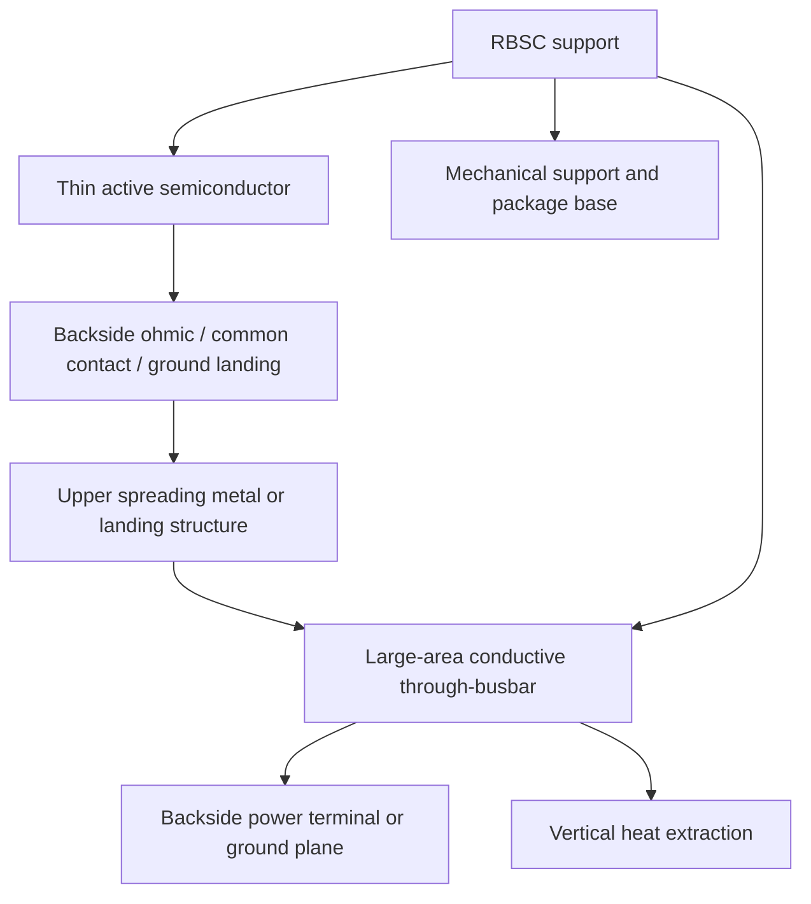
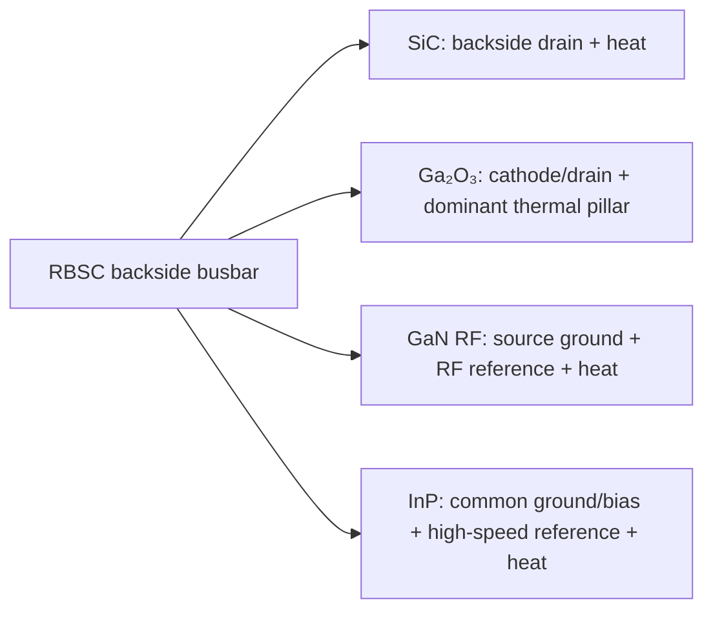
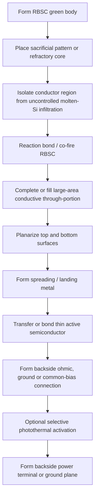

# Cools RBSC Backside Busbar Platform

## One large-area through-busbar for power, ground and heat

> **Stop routing electricity, ground and heat through separate structures.**  
> **Cools integrates all three into a large-area conductive busbar through the RBSC support.**

[한국어](README_KR.md) · [中文](README_ZH.md) · [Patent Portfolio](PATENT_PORTFOLIO.md)

---

## Executive proposition

The **Cools RBSC Backside Busbar Platform** is a patent-backed semiconductor infrastructure that combines:

- a thin active semiconductor layer;
- a reaction-bonded silicon carbide (**RBSC**) support;
- one or more **large-area conductive through-portions** formed through the RBSC thickness;
- an upper current-spreading, grounding or bias-landing structure; and
- a backside electrode or ground plane.

The conductive through-portion is not treated as a fine signal via. It is designed as a **millimeter-class electrical–thermal busbar** that can perform several functions at the same time:

1. backside drain or cathode terminal for a vertical power device;
2. low-inductance source-ground return for a lateral RF device;
3. common ground or bias terminal for an optoelectronic device;
4. high-speed backside reference plane; and
5. dominant vertical heat-extraction path.

```text
Thin active semiconductor
→ backside ohmic/contact or ground landing
→ large-area conductive through-busbar
→ backside power/ground plane
→ direct vertical heat extraction
```

The platform is applicable to thin-film **SiC, Ga₂O₃, GaN and InP-based III–V devices**, including power semiconductors, RF HEMTs, optical engines, short-wave infrared image sensors, quantum-key-distribution photonics and space multi-junction solar cells.

---

## The industrial contradiction

Advanced semiconductor devices repeatedly solve electrical, mechanical and thermal requirements with separate structures:

```text
Thick conductive substrate
+ fine through-substrate vias
+ wire-bond or package ground
+ separate submount
+ solder interfaces
+ external heat sink
```

This creates four recurring penalties.

### 1. The substrate becomes part of the electrical loss

In conventional vertical SiC devices, a thick conductive SiC substrate remains in series with the drift region and contributes substrate resistance to the specific on-resistance. Wafer thinning reduces this contribution but introduces bow, breakage and handling loss.

### 2. Fine TSVs remain process-intensive and inductive

A lateral GaN RF HEMT may require substrate thinning followed by deep, high-aspect-ratio through-substrate via formation to connect the front-side source to a backside ground. The via cross-section and placement are constrained, while the thinning and etching sequence reduces throughput and yield.

### 3. Ground and heat are routed through different assemblies

InP lasers, modulators, amplifiers and photodetectors commonly use wire-bond ground returns and separate soldered submount or heat-sink paths. The electrical reference and thermal path therefore accumulate different parasitic interfaces.

### 4. A thermally useful RBSC support is electrically unreliable as a bulk current path

RBSC can provide high stiffness, useful thermal conductivity and low manufacturing cost, but its bulk electrical resistivity varies with residual silicon content, composition and processing. The platform therefore does **not** depend on RBSC bulk conductivity. It bypasses that uncertainty with a deliberately designed metal busbar.

---

## The architectural change

The Cools platform assigns each material only the role it can perform predictably.

| Platform element | Primary role |
|---|---|
| Thin single-crystal or III–V active layer | carrier transport, light emission/detection, electric-field support |
| RBSC support | mechanical support, heat spreading, package base, low-cost bulk replacement |
| Large-area conductive through-busbar | controlled electrical path, low-inductance ground, vertical thermal pillar |
| Upper spreading/landing metal | parallel connection and current or ground distribution |
| Backside electrode/ground plane | external power terminal, RF reference plane and cooling interface |

The key design rule is:

> **RBSC carries the structure. The metal through-busbar carries the controlled current, ground return and concentrated heat flow.**

---

## Why it is a busbar—not a via

The patent family distinguishes the conductive through-portion from a conventional fine signal via.

- minimum transverse dimension: **0.3 mm or greater**;
- preferred transverse dimension: approximately **0.5–5 mm**;
- possible geometries: circular, elongated, slot, grid, strip, busbar or inserted metal bar;
- total conductive opening ratio: representative design range of **5–60%** of the support backside area;
- possible materials: Mo, W, Cu–Mo, Cu–W, Cu, Ag, Ni or related alloys;
- interface options: co-fired transition skin, Ag/Cu sintered joint, active-brazed joint or metallurgical sidewall bond.

The large cross-section changes the function from local interconnection to **dominant infrastructure**.

### Dominant electrical path

The conductive route is designed to have lower area-normalized resistance than the RBSC bulk route. Patent embodiments describe routing at least 50%, preferably 80%, and more preferably 95% or more of the relevant current or ground-return current through the busbar.

### Dominant thermal path

For thermally constrained devices, the busbar is also positioned under the active or hotspot region so that its vertical thermal resistance is lower than the lateral active-layer and RBSC-bulk path. Patent embodiments describe extracting at least 50%, preferably 70%, and more preferably 90% or more of the generated heat through the conductive through-portion.

These values are **patent-described engineering design ranges and targets**, not publicly reported production measurements.

---

## Unified platform architecture



The same lower infrastructure changes function according to the active device:



---

# Platform layers

## Layer 1 — Material-neutral backside-terminal infrastructure

The umbrella platform places a thin semiconductor layer above an RBSC support and routes the backside terminal through one or more large-area conductive through-portions.

Unlike a conductive ceramic substrate concept, the design remains functional across a wide RBSC bulk-resistivity range because the semiconductor current does not rely on the RBSC bulk as its primary path. The terminal resistance is instead governed by the geometry and conductivity of the inserted or co-fired metal structure.

The platform can support:

- vertical and quasi-vertical power devices;
- lateral RF devices requiring backside grounding;
- optoelectronic devices requiring common ground or bias;
- photonic integrated circuits and optical engines;
- intermediate wafer-level products before device singulation.

## Layer 2 — Green-body co-fired manufacturing

Drilling a large or high-aspect-ratio opening after SiC densification is slow and tool-intensive. The manufacturing family therefore forms the conductive structure at the RBSC green-body stage.

Three representative routes are defined:

1. **sacrificial-pattern route** — a pin or rod is embedded, removed after reaction bonding, and the resulting cavity is filled with metal;
2. **refractory-core route** — Mo, W or a related core is co-fired with the green body;
3. **hybrid-liner route** — a refractory liner is co-fired and a lower-resistance metal is subsequently filled.

The process addresses two difficult requirements simultaneously:

- isolating the low-resistance metal core from uncontrolled molten-silicon wetting, alloying or silicide formation; and
- forming a gap-free, hermetic co-fired interface despite thermal-expansion and shrinkage mismatch.

A SiC-rich sleeve, barrier coating or hermetic encapsulation can protect the conductor bulk while allowing a controlled transition skin at the conductor–RBSC boundary. The resulting interface is structurally distinguishable from a drilled-and-filled via because it can lack a machined wall and separate adhesive layer.

## Layer 3 — Substrate-resistance-free vertical SiC power devices

The SiC device family removes the thick conductive SiC substrate from the final drain-current path.

```text
Conventional:
channel + JFET + drift + thick conductive SiC substrate + contact

Cools:
channel + JFET + drift + thin backside contact layer
→ backside ohmic
→ large-area RBSC through-busbar
```

The drift layer required for voltage support remains. What is removed is the thick substrate portion that adds series resistance while contributing little to electric-field blocking.

The RBSC support then supplies mechanical handling and heat spreading, while the busbar supplies the backside drain and vertical thermal path. The concept is particularly relevant to medium-voltage classes where substrate resistance can represent a meaningful fraction of total on-resistance, while remaining applicable to higher-voltage devices.

## Layer 4 — Ga₂O₃ vertical power: electrical terminal plus thermal pillar

Ga₂O₃ offers a high breakdown field but suffers from intrinsically low thermal conductivity. Merely mounting a Ga₂O₃ device on a heat spreader leaves the low-conductivity lateral path and added bonding interfaces in series.

The Cools architecture instead places the large-area conductive through-portion directly below the active hotspot and uses the same structure as:

- backside drain or cathode;
- electrical busbar;
- vertical thermal pillar; and
- backside cooling interface.

An optional SiC intermediate layer can spread heat laterally over a short distance and couple it into the vertical metal path. The active Ga₂O₃ layer can be thinned to reduce electrical and thermal path length, while the through-busbar removes the resulting concentrated heat directly toward the backside.

## Layer 5 — TSV-free low-inductance grounding for lateral GaN RF HEMTs

In a lateral GaN RF HEMT, source, gate and drain remain on the front side. The Cools platform does not convert the device into a vertical drain device. Instead, it connects the front-side source to a pre-formed large-area through-busbar by a low-aspect-ratio opening, strap, air bridge or landing metal.

The busbar then connects to a continuous backside ground plane.

```text
Front-side source finger
→ short local landing
→ large-area through-busbar
→ backside RF ground plane
```

This can replace the sequence of substrate thinning and deep backside TSV etching. Aligning strip or busbar structures under source fingers can reduce source-ground inductance finger by finger, stabilize the RF reference plane and simultaneously provide a vertical heat path.

## Layer 6 — InP optoelectronics: common ground, bias, reference plane and heat

For InP-based lasers, electro-absorption modulators, Mach–Zehnder modulators, semiconductor optical amplifiers, photodiodes, avalanche photodiodes and single-photon avalanche diodes, the front side retains the optical and high-speed signal structures.

The backside busbar is used for:

- common cathode or anode return;
- common bias return;
- low-inductance RF ground;
- backside high-speed reference plane; and
- vertical heat extraction.

This merges functions normally split between wire bonds, package grounds, soldered submounts and separate heat sinks. Multiple optoelectronic devices can share a common backside reference and cooling plane within an optical engine.

## Layer 7 — Selective photothermal processing of InP-on-SiC stacks

The patent family also uses the optical transmission window of SiC-based support layers to locally process selected regions of InP-based III–V thin-film stacks.

A photothermal beam can enter from the front, backside, side, optical via or transparent window. Selected absorbing regions can include multiple quantum wells, doped regions, free-carrier absorption regions, implantation-damaged layers, defect states, metal underlayers or reaction interfaces.

Functions include:

- quantum-well intermixing;
- local bandgap and wavelength shift;
- exfoliation-damage and defect recovery;
- dopant activation; and
- channel-by-channel wavelength trimming.

Photoluminescence, reflection or temperature monitoring can be used for closed-loop control.

## Layer 8 — Co-Packaged Optics

In the Co-Packaged Optics (**CPO**) application, InP-based active optical films are transferred to a SiC-based support or interposer near a switch or accelerator ASIC.

The SiC platform provides:

- heat spreading for dense optical engines;
- low-CTE mechanical reference;
- optical-alignment surface;
- package base or interposer function; and
- support for short electrical interconnects to the ASIC.

The architecture can combine InP active devices with Si, SiN, SiO₂ or SiC passive waveguides. Thermal-isolation features may be inserted between a high-power ASIC and temperature-sensitive optical engines, while the common SiC platform removes the combined heat externally.

## Layer 9 — Bump-free SWIR image sensing

The short-wave infrared (**SWIR**) family transfers an InGaAs-based photodetector stack onto a silicon CMOS read-out integrated circuit through a thin SiC intermediary.

The objective is to replace pixel-by-pixel indium-bump flip-chip assembly with a monolithically integrated thin-film detector array using through-film or around-film pixel connections.

The SiC thin film provides:

- thermal spreading to suppress dark current and thermal noise;
- CTE mediation between the III–V detector and silicon ROIC;
- transfer and mechanical support; and
- compatibility with fine pixel pitches, including patent-described pitches of 5 µm or below.

## Layer 10 — Quantum Key Distribution photonics

The Quantum Key Distribution (**QKD**) family integrates InP-based optical sources, InGaAs/InP single-photon avalanche detectors, encoders and optional graphene layers on a SiC-based heat-dissipating support.

Thermal stabilization is directed toward:

- laser wavelength and mean-photon-number stability;
- single-photon source purity and linewidth;
- lower detector dark-count rate and afterpulsing;
- reduced phase and polarization drift; and
- lower quantum bit error rate.

The platform supports integrated Alice transmitter and Bob receiver configurations while reducing dependence on thick InP substrates.

## Layer 11 — Space multi-junction solar cells

The space-solar family transfers an InP-based III–V multi-junction thin-film stack to a SiC-based heat-dissipating and supporting platform.

The architecture seeks to separate active junction design from a thick Ge growth substrate so that:

- the support can be lighter and more thermally conductive;
- sub-cell bandgaps are not limited solely by Ge lattice matching;
- sequential thin-film transfer or bonding can integrate different sub-cell families;
- graphene or other ITO-free transparent electrodes can be used; and
- donor substrates can be regenerated and reused.

Patent embodiments describe three or more junctions, including higher-junction-count designs, and describe donor-reuse material reductions as engineering projections rather than public manufacturing results.

---

## Manufacturing architecture



The sequence can be rearranged according to the semiconductor material and whether the lower metal is formed before transfer, after transfer, or by localized reaction between the through-busbar top and the semiconductor backside contact layer.

---

## What the platform replaces

| Conventional element | Cools replacement |
|---|---|
| Thick conductive SiC substrate in current path | thin active SiC + large-area backside busbar |
| Deep, fine GaN backside TSV | pre-formed large-area source-ground busbar |
| Wire-bond common ground | continuous backside busbar and ground plane |
| Separate electrical ground and thermal path | shared electrical–thermal through-busbar |
| Separate ceramic submount and multiple solder interfaces | RBSC support as structural and thermal package base |
| Blanket thermal processing | optional localized photothermal interface activation |

---

## Relationship to other Cools platforms

The platform is complementary to—not a duplicate of—the broader Cools RBSC WBG Power Platform.

```text
Cools RBSC WBG Power Platform
= where the expensive single-crystal active material ends
  and the low-cost support / cooling / package architecture begins

Cools RBSC Backside Busbar Platform
= how current, ground, bias and heat are extracted
  through that support to the backside
```

It is also complementary to Cools sub-bandgap processing technologies. Localized optical processing can activate a backside ohmic or interface without making optical processing a mandatory element of every busbar embodiment.

---

## Target applications

- 650 V–10 kV vertical SiC MOSFETs, JBS/SBD/PIN devices and related power structures;
- vertical Ga₂O₃ MOSFETs, SBDs, PIN diodes and CAVET-type devices;
- GaN RF HEMTs, MMICs, radar, satellite and millimeter-wave power amplifiers;
- InP DFB/DBR lasers, EMLs, MZMs, SOAs, PDs, APDs and SPADs;
- CPO and optical-I/O engines for switch and accelerator ASICs;
- fine-pitch InGaAs SWIR image sensors;
- integrated QKD transmitters and receivers;
- lightweight space multi-junction solar arrays.

---

## Validation roadmap

The patent family defines measurable engineering fingerprints and validation paths.

### Electrical

- busbar path resistance versus RBSC bulk path resistance;
- fraction of current or ground return carried by the busbar;
- specific on-resistance with and without the thick SiC substrate;
- source-ground inductance from S-parameters and small-signal extraction;
- backside common-ground impedance for optical engines.

### Thermal

- heat-flow fraction through the conductive through-portion;
- junction-to-backside thermal resistance;
- hotspot temperature and thermal transient;
- comparison of backside-only and double-sided cooling;
- optical-engine wavelength drift versus temperature.

### Structural and manufacturing

- conductor–RBSC interface cross-section;
- distinction between co-fired transition skin and drilled/filled sidewall;
- hermeticity and thermal-cycle reliability;
- molten-silicon intrusion or conductor alloying;
- panel-level dimensional uniformity and planarization.

### Device performance

- SiC on-resistance and breakdown;
- Ga₂O₃ junction temperature and power density;
- GaN RF gain, PAE, stability and fmax;
- InP laser wavelength, detector noise and link performance;
- SWIR dark current and pixel uniformity;
- QKD detector dark counts and QBER;
- solar-cell specific power and thermal stability.

---

## Patent-backed portfolio

This repository summarizes **11 patent-filed invention axes**. See [PATENT_PORTFOLIO.md](PATENT_PORTFOLIO.md) for the detailed architecture.

The portfolio covers:

- umbrella backside-terminal infrastructure;
- co-fired RBSC manufacturing;
- SiC substrate-resistance removal;
- Ga₂O₃ electrical–thermal vertical extraction;
- GaN TSV-free low-inductance source grounding;
- InP backside common ground, bias and cooling;
- InP-on-SiC selective photothermal processing;
- CPO;
- SWIR imaging;
- QKD; and
- space multi-junction solar cells.

---

## Collaboration and transaction scope

Potential transaction structures include:

- joint process development;
- wafer or panel demonstrator programs;
- application-specific licensing;
- platform licensing by material family;
- co-development of co-fired RBSC supports;
- device, module or optical-engine integration partnerships; and
- manufacturing-equipment collaboration for localized interface activation.

Priority counterparties include power-device manufacturers, RF foundries, optical-engine developers, image-sensor companies, quantum-photonics developers, space-power suppliers, RBSC manufacturers, metallization suppliers and packaging-equipment companies.

---

## Important notice

This repository is a public technical summary of patent-filed concepts. It is not a license, a manufacturing specification, a guaranteed performance statement or a disclosure of all process know-how.

Numerical ranges and performance statements identified as targets, design ranges, examples or projections originate from the patent documents and require experimental validation for each material stack, geometry and manufacturing line.

Detailed recipes, surface preparation, joining conditions, conductor compositions, thermal histories, tolerances and scale-up know-how remain reserved.

---

## Contact

**Cools**  
Jinhyun Cho  
Technology licensing · Joint development · Strategic partnership
