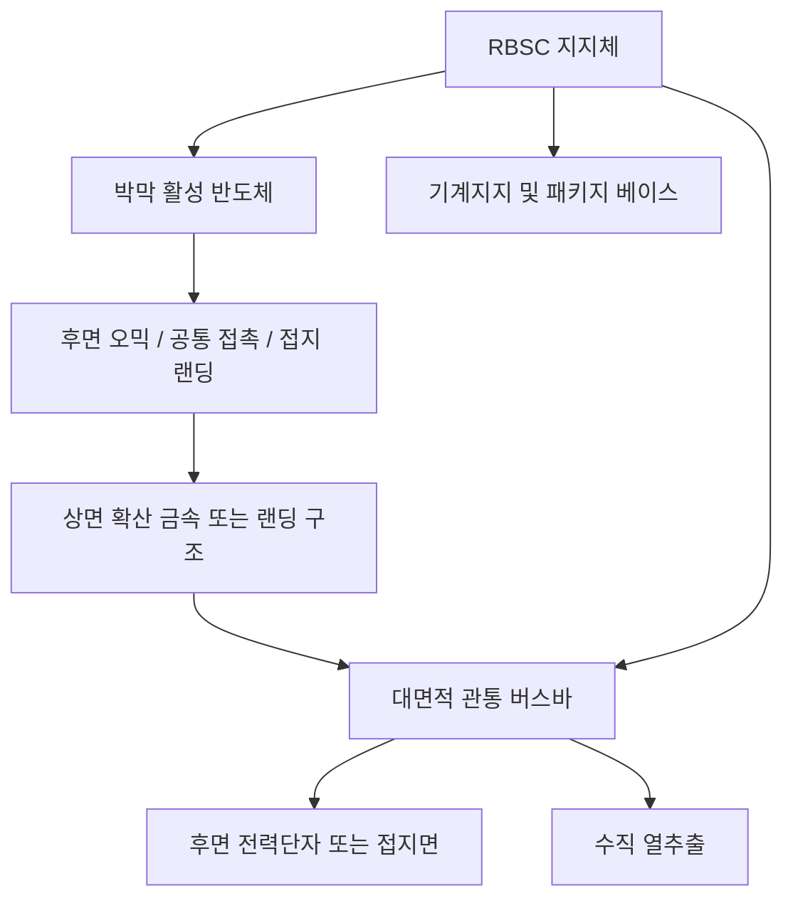
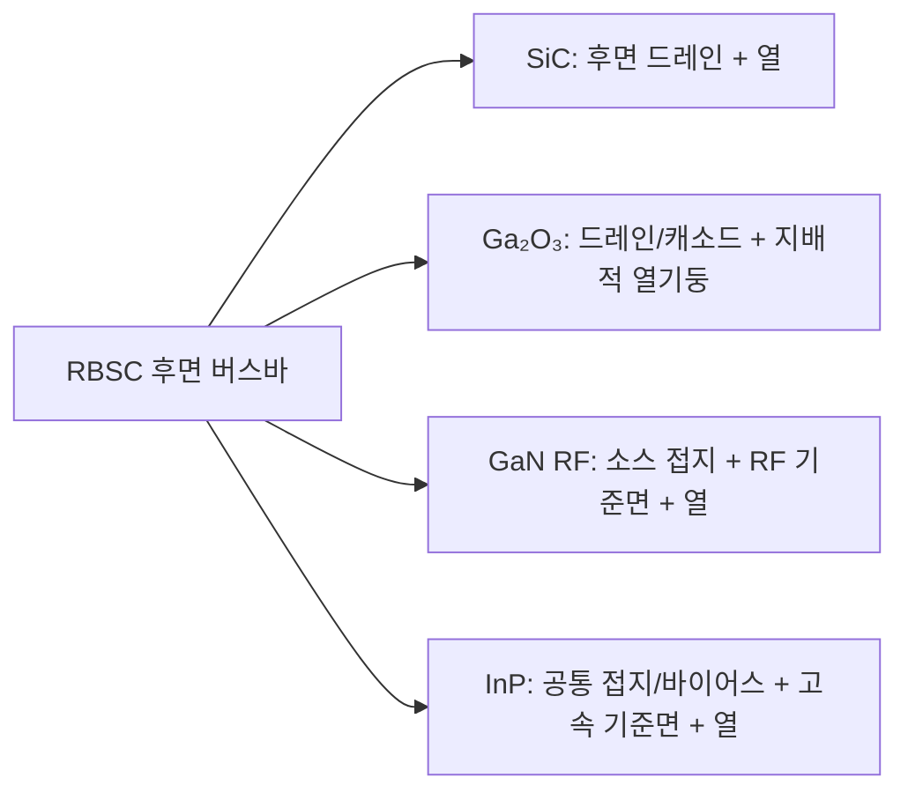
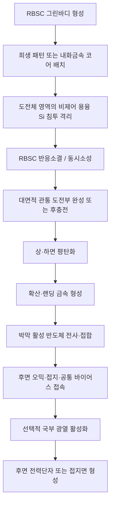

# Cools RBSC 후면 버스바 플랫폼

## 하나의 대면적 관통 버스바로 전력·접지·열을 동시에 인출

> **전력·접지·열을 서로 다른 구조로 인출하지 않습니다.**  
> **Cools는 반응결합 탄화규소(RBSC) 지지체를 관통하는 하나의 대면적 버스바에 세 기능을 통합합니다.**

[English](README.md) · [中文](README_ZH.md) · [특허 포트폴리오](PATENT_PORTFOLIO.md)

---

## 핵심 제안

**Cools RBSC 후면 버스바 플랫폼**은 다음을 하나의 하부 인프라로 결합하는 특허 기반 반도체 플랫폼입니다.

- 박막 반도체 활성층
- 반응결합 탄화규소(Reaction-Bonded Silicon Carbide, RBSC) 지지체
- RBSC 두께 방향을 관통하는 하나 이상의 **대면적 도전성 관통부**
- 상면 전류확산·접지·바이어스 랜딩 구조
- 하면 전극 또는 공통 접지면

이 관통부는 미세 신호 비아가 아닙니다. 최소 횡단치수 0.3㎜ 이상, 바람직하게는 0.5~5㎜급의 **전기·열 버스바**로서 다음 기능을 동시에 수행합니다.

1. 수직형 전력소자의 후면 드레인 또는 캐소드
2. 횡형 RF 소자의 저인덕턴스 소스 접지
3. 광전자 소자의 공통 접지 또는 바이어스
4. 고속 신호의 후면 기준면
5. 발열부 직하의 지배적 수직 열추출 경로

```text
박막 활성 반도체
→ 후면 오믹·공통 접촉·접지 랜딩
→ 대면적 관통 버스바
→ 후면 전력단자·접지면
→ 직접 수직 열추출
```

적용 재료는 박막 **SiC, Ga₂O₃, GaN, InP계 III-V**이며, 전력반도체·RF HEMT·광엔진·단파장 적외선 이미지센서·양자키분배·우주용 다접합 태양전지까지 확장됩니다.

---

## 기존 구조의 모순

기존 반도체 소자는 전기·기계·열 요구를 서로 다른 구조로 해결합니다.

```text
두꺼운 도전성 기판
+ 미세 기판관통비아
+ 와이어본드 접지
+ 별도 서브마운트
+ 솔더 계면
+ 외부 히트싱크
```

그 결과 다음 문제가 반복됩니다.

### 두꺼운 기판이 전기저항이 됨

수직형 SiC 소자에서는 두꺼운 도전성 SiC 기판이 드리프트층과 직렬로 연결되어 비저항 온저항에 기판저항을 추가합니다. 박형화하면 저항은 줄지만 휨·파손·취급성 문제가 증가합니다.

### 미세 TSV는 깊고 느리며 인덕턴스가 남음

횡형 GaN RF HEMT의 후면 소스 접지를 위해서는 기판 박형화와 고종횡비 Through-Substrate Via(TSV) 식각이 필요합니다. 비아 단면적과 배치가 제한되고 공정 수율과 처리량이 낮아집니다.

### 접지와 열이 별도의 조립체를 통과함

InP 레이저·변조기·광증폭기·광검출기는 와이어본드로 접지를 인출하고, 별도 서브마운트·솔더·히트싱크로 열을 방출합니다. 전기 기준면과 열경로가 서로 다른 기생 계면을 가집니다.

### RBSC는 열적으로 유용하지만 벌크 전기경로로 신뢰하기 어려움

RBSC의 체적저항은 잔류 실리콘 함량·조성·공정에 따라 크게 달라질 수 있습니다. 따라서 Cools는 RBSC 벌크 전도도에 의존하지 않고, 설계값이 명확한 금속 대면적 관통부로 전류를 우회시킵니다.

---

## 구조적 전환

| 플랫폼 구성 | 주 기능 |
|---|---|
| 박막 단결정 또는 III-V 활성층 | 전하수송·발광·수광·전계지지 |
| RBSC 지지체 | 기계지지·열확산·패키지 베이스·저가 벌크 대체 |
| 대면적 관통 버스바 | 제어 가능한 전류경로·저인덕턴스 접지·수직 열기둥 |
| 상면 확산·랜딩 금속 | 전류·접지·바이어스 분배 |
| 하면 전극·접지면 | 외부 전력단자·RF 기준면·냉각면 |

> **RBSC는 구조를 담당하고, 금속 버스바는 전류·접지·집중 열류를 담당합니다.**

---

## 비아가 아니라 버스바인 이유

- 최소 횡단치수: 0.3㎜ 이상
- 바람직한 횡단치수: 0.5~5㎜
- 형상: 원형·장공·슬롯·격자·띠·버스바·금속바 삽입형
- 대표 개구율: 하면 면적의 5~60%
- 재료: Mo, W, Cu-Mo, Cu-W, Cu, Ag, Ni 및 합금
- 계면: 동시소성 천이스킨, Ag/Cu 소결, 활성 브레이징 또는 야금학적 측벽 접합

### 지배적 전기경로

특허 실시형태에서는 관련 전류 또는 접지 귀환전류의 50% 이상, 바람직하게는 80% 이상, 더욱 바람직하게는 95% 이상이 관통 버스바를 통하도록 설계합니다.

### 지배적 열경로

발열영역 직하에 버스바를 배치하고 그 수직 열저항을 횡방향 활성층 및 RBSC 벌크 경로보다 낮게 설계하여, 발생열의 50% 이상, 바람직하게는 70% 이상, 더욱 바람직하게는 90% 이상을 관통부로 인출합니다.

위 수치는 특허에 기재된 설계범위·목표·실시형태이며 공개 양산 측정값은 아닙니다.

---

## 통합 아키텍처





---

# 11개 플랫폼 계층

## 1. 재료 중립형 후면 단자 모플랫폼

박막 반도체층의 후면 단자를 RBSC 하면으로 인출하되, RBSC 벌크를 주 전도경로로 사용하지 않고 대면적 금속 관통부를 지배경로로 사용합니다.

적용 범위:

- 수직·준수직 전력소자
- 횡형 RF 후면 접지 소자
- 공통 접지·바이어스가 필요한 광전자 소자
- CPO·PIC·LiDAR 광엔진
- 웨이퍼 레벨 중간 적층체

## 2. 그린바디 동시소성 제조기술

치밀화된 SiC를 소결 후 천공하지 않고, RBSC 그린바디 단계에서 관통 도전부를 일체 형성합니다.

대표 경로:

1. 희생 핀·로드 제거 후 금속 충전
2. Mo·W 내화금속 코어 동시소성
3. 내화 라이너 동시소성 후 저저항 금속 후충전

핵심은 반응소결 중 용융 실리콘이 도전체 벌크를 침범하지 않도록 격리하면서, 도전체와 RBSC 사이에는 무간극 기밀의 야금학적 연속 계면을 형성하는 것입니다.

## 3. 두꺼운 기판 저항을 제거한 박막 SiC 수직 전력소자

전계 지지에 필요한 드리프트층은 유지하되, 그 아래에서 기계지지와 전류경로 역할만 하던 두꺼운 도전성 SiC 기판을 제거합니다.

```text
종래:
채널 + JFET + 드리프트 + 두꺼운 도전성 SiC 기판 + 콘택

Cools:
채널 + JFET + 드리프트 + 박형 후면 콘택층
→ 후면 오믹
→ RBSC 대면적 관통 버스바
```

RBSC가 박막의 기계적 취급성과 방열을 담당하고, 관통부가 후면 드레인과 열경로를 담당합니다.

## 4. Ga₂O₃ 전기단자·열기둥 통합

Ga₂O₃는 높은 절연파괴전계를 가지지만 열전도도가 낮습니다. Cools는 발열영역 직하에 대면적 관통부를 집중 배치해 동일 구조가 다음 기능을 겸하도록 합니다.

- 후면 드레인 또는 캐소드
- 전력 버스바
- 지배적 수직 열기둥
- 하면 냉각 인터페이스

선택적으로 SiC 중간층이 열을 짧은 거리로 확산시켜 관통부로 결합합니다.

## 5. GaN RF HEMT의 TSV 없는 저인덕턴스 후면 접지

소스·게이트·드레인은 전면에 유지합니다. 전면 소스를 저종횡비 개구부·스트랩·에어브리지·랜딩 금속으로 사전 형성된 대면적 관통부 상단에 연결합니다.

```text
전면 소스 핑거
→ 짧은 국부 접속
→ 대면적 관통 버스바
→ 후면 RF 접지면
```

소스 핑거 직하에 버스바를 정렬하면 핑거별 접지 인덕턴스를 낮추면서 동일 구조로 열도 인출할 수 있습니다.

## 6. InP 광전자 공통 접지·바이어스·열 통합

InP계 레이저·전계흡수 변조기·마흐-젠더 변조기·반도체 광증폭기·포토다이오드·APD·SPAD의 전면 광·고속 신호 구조는 유지합니다.

후면 버스바는 다음을 통합합니다.

- 공통 캐소드·애노드 또는 바이어스 귀환
- 저인덕턴스 RF 접지
- 후면 고속 기준면
- 수직 열추출

와이어본드 접지와 별도 서브마운트·솔더·히트싱크 경로를 하나의 하부 구조로 줄입니다.

## 7. InP-on-SiC 선택 광열 처리

SiC계 지지층의 광투과창을 이용해 InP계 III-V 박막의 선택흡수영역만 국부 가열합니다.

처리 기능:

- 양자우물 혼합
- 국부 밴드갭 및 파장 천이
- 박리 손상·점결함 회복
- 도펀트 활성화
- 소자·채널별 중심파장 트리밍

입사 경로는 전면·후면·측면·광 비아·투명창이며, 광발광·반사·온도 피드백을 이용한 폐루프 제어가 가능합니다.

## 8. 코패키지드 옵틱스

InP계 능동 광소자 박막을 SiC계 방열·정렬 플랫폼 위에 전사하고 스위치 또는 가속기 ASIC에 인접 배치합니다.

SiC 플랫폼은 광엔진의 방열, 저열팽창 기준면, 광정렬면, 패키지 베이스 및 인터포저 역할을 수행합니다. ASIC과 광엔진 사이에는 별도 열격리 구조를 두어 직접 열유입을 차단하면서 공통 SiC 플랫폼이 총발열을 외부로 배출할 수 있습니다.

## 9. 인듐 범프 없는 SWIR 이미지센서

박막 SiC를 매개로 InGaAs 광검출 적층체를 실리콘 CMOS 판독 집적회로 위에 전사합니다.

목표:

- 인듐 범프 피치 한계 제거
- 5㎛ 이하의 미세 화소
- 대면적·고균일 어레이
- SiC 방열에 의한 암전류·열잡음 억제
- 화소별 관통 또는 우회 접속을 통한 ROIC 연결

## 10. 양자키분배 광반도체

InP계 광원, InGaAs/InP SPAD, 인코더 및 선택적 그래핀층을 SiC 지지체에 통합합니다.

SiC의 방열과 저열팽창으로 다음을 안정화합니다.

- 레이저 중심파장·평균 광자수
- 단광자 순도·선폭
- SPAD 암계수율·애프터펄싱
- 위상·편광 드리프트
- Quantum Bit Error Rate(QBER)

## 11. 우주용 다접합 태양전지

InP계 III-V 다접합 박막을 SiC계 방열·지지 플랫폼으로 전사합니다.

- Ge 기판의 중량과 방열 한계 저감
- Ge 격자정합에만 묶이지 않는 서브셀 조합
- 복수 도너 순차 전사·본딩
- 그래핀 등 ITO-free 투명전극
- 도너 재사용에 의한 소재 사용량 저감

특허에 기재된 고접합수·재료절감 수치는 설계예·예측치이며 실제 양산 검증 대상입니다.

---

## 제조 흐름



---

## 대체하는 기존 구조

| 기존 요소 | Cools 대체 구조 |
|---|---|
| 전류경로의 두꺼운 도전성 SiC 기판 | 박막 SiC + 대면적 후면 버스바 |
| GaN의 깊은 미세 후면 TSV | 사전 형성 대면적 소스 접지 버스바 |
| 와이어본드 공통 접지 | 연속 후면 버스바·접지면 |
| 별도 전기접지·열경로 | 전기·열 공용 관통 버스바 |
| 세라믹 서브마운트·다중 솔더 계면 | RBSC 지지체의 패키지 베이스화 |
| 전면적 고온처리 | 선택적 국부 광열 계면 활성화 옵션 |

---

## 기존 Cools 플랫폼과의 관계

```text
Cools RBSC WBG Power Platform
= 고가 단결정 활성재료를 어디까지 얇게 사용하고
  RBSC가 어디서부터 지지·방열·패키징을 담당할 것인가

Cools RBSC Backside Busbar Platform
= 그 지지체를 통하여 전류·접지·바이어스·열을
  어떻게 후면으로 직접 인출할 것인가
```

선택 광열 기술은 후면 오믹이나 접합계면을 국부 활성화하는 선택적 제조수단이며, 모든 버스바 실시형태의 필수요소로 한정하지 않습니다.

---

## 주요 검증 항목

### 전기

- 버스바 경로와 RBSC 벌크 경로의 저항 비교
- 버스바를 통하는 전류·접지 귀환 비율
- 두꺼운 SiC 기판 제거 전후 비저항 온저항
- S-파라미터와 소신호 모델에 의한 접지 인덕턴스
- 광엔진 후면 공통접지 임피던스

### 열

- 관통부를 통하는 열류 비율
- 접합부-하면 열저항
- 핫스폿 온도 및 과도응답
- 하면 냉각·양면 냉각 비교
- 광엔진 온도 대비 파장 드리프트

### 구조·제조

- 도전체-RBSC 동시소성 계면 단면
- 기계가공벽 없는 천이스킨 지문
- 기밀·열사이클 신뢰성
- 용융 실리콘 침투·도전체 합금화 여부
- 패널급 치수 균일도와 평탄도

---

## 특허 포트폴리오

본 저장소는 **11개 출원 발명축**을 통합합니다. 자세한 내용은 [PATENT_PORTFOLIO.md](PATENT_PORTFOLIO.md)를 참조하십시오.

포트폴리오는 다음을 포함합니다.

- 후면 단자 모플랫폼
- RBSC 그린바디 동시소성
- SiC 기판 직렬저항 제거
- Ga₂O₃ 전기·열 수직 인출
- GaN TSV 없는 저인덕턴스 접지
- InP 공통 접지·바이어스·방열
- InP-on-SiC 선택 광열 처리
- CPO
- SWIR
- QKD
- 우주용 다접합 태양전지

---

## 협력·거래 범위

- 공동 공정개발
- 웨이퍼·패널 데모
- 재료군별 플랫폼 라이선스
- 응용별 라이선스
- 동시소성 RBSC 지지체 공동개발
- 전력소자·RF·광엔진·센서·우주전력 통합
- 국부 계면 활성화 장비 협력

---

## 고지

본 저장소는 특허출원된 기술개념의 공개 요약이며, 라이선스·제조사양·성능보증 또는 전체 노하우 공개가 아닙니다.

수치범위와 성능표현 중 목표·설계범위·예시·예측으로 기재된 항목은 재료·형상·생산라인별 실험 검증이 필요합니다. 표면처리, 접합조건, 도전체 조성, 열이력, 공차 및 양산 노하우는 공개범위에서 제외됩니다.

---

## Contact

**Cools**  
조진현 · Jinhyun Cho  
기술 라이선스 · 공동개발 · 전략적 파트너십
