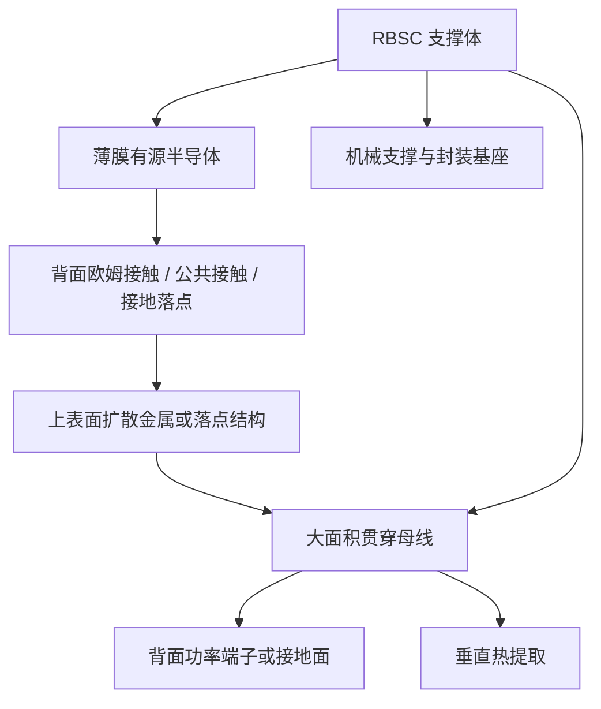
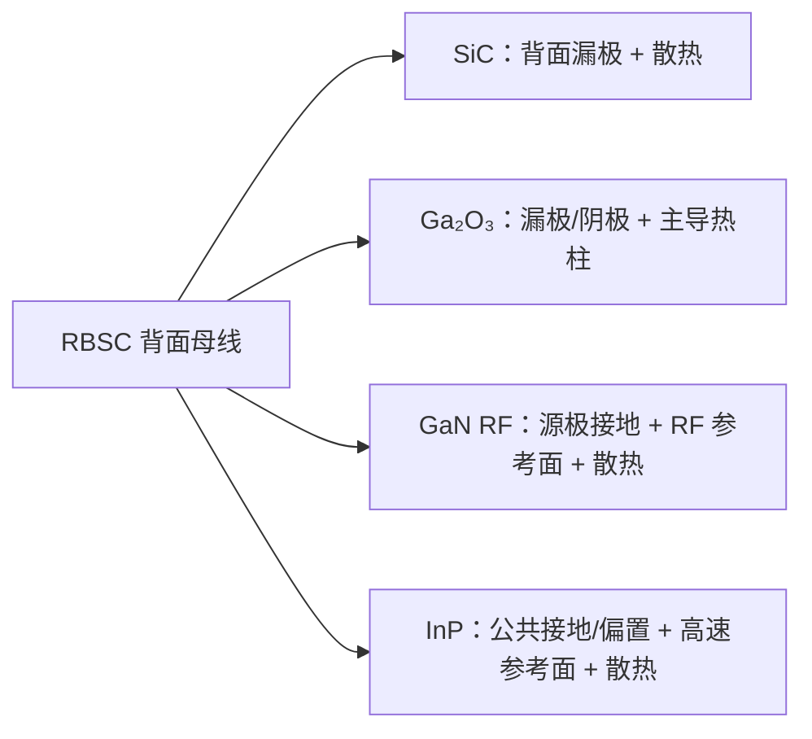
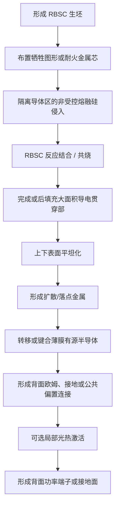

# Cools RBSC 背面母线平台

## 以一体化大面积贯穿母线同时导出功率、接地与热流

> **不再通过彼此分离的结构分别传输电流、接地回流和热量。**  
> **Cools 将三者集成到贯穿反应结合碳化硅（RBSC）支撑体的大面积导电母线中。**

[English](README.md) · [한국어](README_KR.md) · [专利组合](PATENT_PORTFOLIO.md)

---

## 核心主张

**Cools RBSC 背面母线平台**是一套由专利申请支撑的半导体下层基础架构，集成：

- 薄膜半导体有源层；
- 反应结合碳化硅（Reaction-Bonded Silicon Carbide，RBSC）支撑体；
- 沿 RBSC 厚度方向贯穿的一个或多个**大面积导电贯穿部**；
- 上表面电流扩散、接地或偏置落点结构；
- 背面电极或连续接地面。

该贯穿部并非普通微细信号通孔，而是毫米级**电—热母线**，可同时承担：

1. 垂直功率器件的背面漏极或阴极；
2. 横向射频器件的低电感源极接地回路；
3. 光电子器件的公共接地或偏置端；
4. 高速信号的背面参考平面；
5. 位于发热区正下方的主导垂直散热路径。

```text
薄膜有源半导体
→ 背面欧姆接触 / 公共接触 / 接地落点
→ 大面积贯穿母线
→ 背面功率端子或接地平面
→ 直接垂直导热
```

该平台覆盖薄膜 **SiC、Ga₂O₃、GaN 与 InP 系 III–V 器件**，包括功率半导体、RF HEMT、光引擎、短波红外成像、量子密钥分发以及空间多结太阳电池。

---

## 传统结构的矛盾

传统器件通常以不同结构分别满足电气、机械和热管理要求：

```text
厚导电衬底
+ 微细基板通孔
+ 键合线接地
+ 独立子载板
+ 多层焊料界面
+ 外置散热器
```

由此反复产生四类问题。

### 厚衬底成为串联电阻

在垂直 SiC 器件中，厚导电 SiC 衬底与漂移区串联，直接增加比导通电阻。减薄虽可降低电阻，却带来翘曲、破裂与搬运良率问题。

### 微细 TSV 工艺复杂且仍有寄生电感

横向 GaN RF HEMT 的背面源极接地通常要求先减薄衬底，再进行深高深宽比通孔刻蚀。通孔截面积和排布受限，吞吐量及良率受到影响。

### 接地与散热通过不同装配路径

InP 激光器、调制器、光放大器和探测器常使用键合线形成接地回路，并通过独立子载板、焊层和散热器排热。高速参考平面与热路径因此积累不同的寄生界面。

### RBSC 适合承载和导热，却不宜依赖其体电阻作为主电流路径

RBSC 的体电阻会随残余硅含量、组成和工艺而变化。Cools 因此不依赖 RBSC 本体导电性，而由几何和电导率可设计的大面积金属母线承担受控电流路径。

---

## 架构转换

| 平台构成 | 主要功能 |
|---|---|
| 薄膜单晶或 III–V 有源层 | 载流子输运、发光/探测、电场承受 |
| RBSC 支撑体 | 机械支撑、热扩散、封装基座、低成本体材料替代 |
| 大面积贯穿母线 | 可控电流路径、低电感接地、垂直热柱 |
| 上部扩散/落点金属 | 电流、接地与偏置分配 |
| 背面电极/接地面 | 外部功率端、RF 参考面与冷却界面 |

> **RBSC 负责结构与扩散，金属贯穿母线负责电流、接地回流和集中热流。**

---

## 为什么是母线，而不是普通通孔

专利组合将该结构与微细信号通孔区分开来：

- 最小横向尺寸：0.3 mm 以上；
- 优选横向尺寸：约 0.5–5 mm；
- 形状：圆形、长孔、槽形、栅格、条形、母线形或插入金属棒形；
- 代表性开口率：支撑体背面面积的 5–60%；
- 材料：Mo、W、Cu–Mo、Cu–W、Cu、Ag、Ni 或相关合金；
- 界面：共烧过渡层、Ag/Cu 烧结连接、活性钎焊或冶金侧壁连接。

### 主导电流路径

专利实施方式提出，使 50% 以上、优选 80% 以上、进一步优选 95% 以上的器件电流或接地回流经由大面积母线传输。

### 主导热路径

通过将母线配置在热点正下方，并使其垂直热阻低于有源层横向路径和 RBSC 本体路径，可使 50% 以上、优选 70% 以上、进一步优选 90% 以上的热量经该贯穿部导出。

这些数值属于专利所述的工程设计范围和目标，并非公开量产实测值。

---

## 统一平台结构





---

# 十一项平台层级

## 1. 材料中性的背面端子母平台

平台将薄膜半导体背面端子引出至 RBSC 背面，并刻意排除 RBSC 本体作为主电流路径。端子电阻主要由金属母线的截面积、材料和布局决定。

适用对象包括垂直及准垂直功率器件、横向 RF 背面接地器件、公共偏置光电子器件、CPO/PIC/LiDAR 光引擎以及晶圆级中间产品。

## 2. RBSC 生坯共烧制造

为避免致密 SiC 烧结后的高成本深孔加工，平台在 RBSC 生坯阶段形成导电贯穿结构。

代表路径：

1. 牺牲销/棒去除后金属填充；
2. Mo、W 等耐火金属芯与生坯共烧；
3. 耐火衬套共烧后再填充低电阻金属。

工艺重点在于：隔离熔融硅对低电阻导体主体的非受控润湿、合金化或硅化，同时在导体与 RBSC 之间形成无间隙、气密的冶金连续界面。

## 3. 去除厚衬底串联电阻的薄膜 SiC 垂直功率器件

保留承受额定电压所需的漂移层，去除其下方主要承担机械支撑和背面电流通路的厚导电 SiC 衬底。

```text
传统：
沟道 + JFET + 漂移区 + 厚导电 SiC 衬底 + 接触

Cools：
沟道 + JFET + 漂移区 + 薄背面高掺杂接触层
→ 背面欧姆接触
→ RBSC 大面积贯穿母线
```

RBSC 提供机械支撑和热扩散，母线则提供背面漏极及垂直散热路径。

## 4. Ga₂O₃ 电端子与热柱一体化

Ga₂O₃ 具有高击穿场，但热导率低。Cools 将大面积贯穿部集中布置在发热区正下方，使同一构件同时成为：

- 背面漏极或阴极；
- 功率母线；
- 主导垂直热柱；
- 背面冷却界面。

可选的 SiC 中间层在短距离内横向扩散热量，并将其耦合至金属热柱。

## 5. 无深 TSV 的 GaN RF HEMT 低电感背面接地

源极、栅极和漏极仍位于正面。正面源极通过低深宽比开口、金属带、空气桥或落点金属连接至预先形成的贯穿母线顶端。

```text
正面源极指
→ 短局部连接
→ 大面积贯穿母线
→ 背面 RF 接地面
```

在每个源极指下方对准母线，可逐指降低接地电感，并由同一结构垂直导出热量。

## 6. InP 光电子公共接地、偏置、参考面与散热

InP 激光器、EML、MZM、SOA、PD、APD 和 SPAD 保留正面光路与高速信号结构。背面母线集成：

- 公共阴极/阳极或偏置回路；
- 低电感 RF 接地；
- 背面高速参考平面；
- 垂直散热。

该结构可替代键合线接地、独立子载板、焊层和独立散热器的多级组合。

## 7. InP-on-SiC 选择性光热处理

利用 SiC 支撑层的光透过窗口，仅对 InP 系 III–V 薄膜中的选择吸收区域进行局部处理。

功能包括：

- 量子阱混合；
- 局部带隙与波长迁移；
- 剥离损伤与点缺陷恢复；
- 掺杂激活；
- 器件或通道级中心波长修调。

光束可由正面、背面、侧面、光通孔或透明窗口入射，并可通过光致发光、反射或温度反馈闭环控制。

## 8. 共封装光学 CPO

将 InP 系有源光薄膜转移至 SiC 散热与对准平台，并靠近交换芯片或加速器 ASIC 布置。

SiC 平台承担光引擎散热、低热膨胀参考、光学对准面、封装基座及可选中介层功能。可在 ASIC 与光引擎之间加入热隔离区，同时由公共 SiC 平台将总热量导出。

## 9. 无铟凸点 SWIR 图像传感器

通过薄膜 SiC 中间层将 InGaAs 光探测叠层转移至硅 CMOS 读出集成电路上。

目标包括：

- 去除铟凸点节距限制；
- 实现专利所述 5 µm 以下像素节距；
- 大面积高均匀阵列；
- 通过 SiC 散热降低暗电流和热噪声；
- 以穿膜或绕膜像素连接接入 ROIC。

## 10. 量子密钥分发光子器件

在 SiC 支撑体上集成 InP 系光源、InGaAs/InP SPAD、编码器和可选石墨烯层。

SiC 的散热和低热膨胀用于稳定：

- 激光中心波长和平均光子数；
- 单光子纯度与线宽；
- SPAD 暗计数率和后脉冲；
- 相位与偏振漂移；
- 量子比特错误率（QBER）。

## 11. 空间多结太阳电池

将 InP 系 III–V 多结薄膜转移到 SiC 散热与支撑平台。

- 降低 Ge 衬底重量和热限制；
- 不再仅受 Ge 晶格匹配约束；
- 支持多个供体顺序转移与键合；
- 采用石墨烯等 ITO-free 透明电极；
- 通过供体再生与重复使用降低材料消耗。

高结数和材料节省量属于专利中的设计示例与预测，仍需器件与量产验证。

---

## 制造流程



---

## 被替代的传统结构

| 传统构成 | Cools 替代结构 |
|---|---|
| 电流路径中的厚导电 SiC 衬底 | 薄膜 SiC + 大面积背面母线 |
| GaN 深微细背面 TSV | 预形成大面积源极接地母线 |
| 键合线公共接地 | 连续背面母线与接地面 |
| 分离的电接地与热路径 | 电—热共用贯穿母线 |
| 独立陶瓷子载板与多层焊接界面 | RBSC 支撑体兼作封装基座 |
| 全片高温处理 | 可选局部光热界面激活 |

---

## 与其他 Cools 平台的关系

```text
Cools RBSC WBG Power Platform
= 高成本单晶有源材料使用到何处，
  RBSC 从何处开始承担支撑、散热与封装

Cools RBSC Backside Busbar Platform
= 电流、接地、偏置与热量如何通过该支撑体
  直接导向背面
```

局部光热处理是激活背面欧姆接触或界面的可选制造手段，不被限定为所有母线实施方式的必要构成。

---

## 验证路线

### 电气

- 母线路径与 RBSC 本体路径电阻对比；
- 经母线传输的电流或接地回流比例；
- 去除厚 SiC 衬底前后的比导通电阻；
- 基于 S 参数和小信号模型的接地电感；
- 光引擎背面公共接地阻抗。

### 热学

- 经导电贯穿部传输的热流比例；
- 结到背面的热阻；
- 热点温度与瞬态响应；
- 单面背冷与双面冷却对比；
- 光引擎波长漂移与温度关系。

### 结构与制造

- 导体—RBSC 共烧界面截面；
- 共烧过渡层与钻孔填充侧壁的结构差异；
- 气密性和热循环可靠性；
- 熔融硅侵入与导体合金化；
- 面板级尺寸均匀性和平坦度。

---

## 专利组合

本仓库归纳 **11 项已申请专利的发明轴**。详见 [PATENT_PORTFOLIO.md](PATENT_PORTFOLIO.md)。

- 背面端子母平台
- RBSC 生坯共烧制造
- SiC 厚衬底串联电阻消除
- Ga₂O₃ 电—热垂直提取
- GaN 无 TSV 低电感接地
- InP 公共接地、偏置与散热
- InP-on-SiC 选择性光热处理
- CPO
- SWIR
- QKD
- 空间多结太阳电池

---

## 合作与交易方式

- 联合工艺开发；
- 晶圆或面板级样品项目；
- 按材料平台或应用领域授权；
- 共烧 RBSC 支撑体联合开发；
- 功率、RF、光引擎、成像、量子与空间电源集成；
- 局部界面激活设备合作。

---

## 声明

本仓库是对已申请专利技术概念的公开技术摘要，不构成许可、制造规范、性能保证或全部工艺诀窍披露。

其中标注为目标、设计范围、示例或预测的数值和性能表述，需要针对具体材料堆叠、几何结构和生产线进行实验验证。表面处理、连接条件、导体组成、热历史、公差和规模化制造诀窍未在此公开。

---

## Contact

**Cools**  
Jinhyun Cho · 조진현  
技术许可 · 联合开发 · 战略合作
